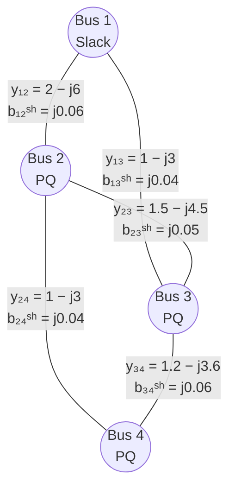

Company: SOPTIM
Version: 1.6
Date: 2026-07-10
Title: Analytical Power Series Load Flow (APSLF)
Author: Dipl.-Ing. Udo Schmitz
Reviewer: Dr. K. F. Schäfer

> *"This text was developed with technical assistance and subsequently reviewed and refined."*

> **License notice:** The AnalyticLoadFlow.jl repository, including source code and documentation, is made available under the Apache-2.0 license unless explicitly stated otherwise. Patent and trademark notes in this article are informational cautions only and are not legal advice.

---

## Table of Contents

- [Analytical Power Series Load Flow (APSLF)](#analytical-power-series-load-flow-apslf)
  - [1. Motivation](#1-motivation)
  - [Patent Notice](#patent-notice)
  - [2. Basic Idea](#2-basic-idea)
    - [2.1 Embedding Parameter $s$](#21-embedding-parameter-s)
    - [Trivial Starting Point $s=0$](#trivial-starting-point-s0)
    - [Physical Operating Point $s=1$](#physical-operating-point-s1)
    - [Analytical Meaning of $s$](#analytical-meaning-of-s)
    - [Role of Parameter $s$](#role-of-parameter-s)
    - [2.2 Holomorphic Voltage Functions](#22-holomorphic-voltage-functions)
      - [Aside: Meaning of the Term *holomorphic*](#aside-meaning-of-the-term-holomorphic)
    - [2.3 Treatment of Complex Conjugation](#23-treatment-of-complex-conjugation)
      - [Why is Complex Conjugation not Holomorphic?](#why-is-complex-conjugation-not-holomorphic)
  - [3. Equations for PQ Buses](#3-equations-for-pq-buses)
  - [4. Recursion Formulas and Linearity per Order](#4-recursion-formulas-and-linearity-per-order)
    - [4.1 Constraint (Convolution)](#41-constraint-convolution)
    - [4.2 Network Equation (Linear System)](#42-network-equation-linear-system)
  - [5. Evaluation at $s = 1$](#5-evaluation-at-s--1)
    - [Padé Approximation](#padé-approximation)
    - [Aside: Meaning of Padé Approximation](#aside-meaning-of-padé-approximation)
    - [Meaning for the Method](#meaning-for-the-method)
    - [Essential Properties](#essential-properties)
  - [6. Practical Treatment of PV Buses](#6-practical-treatment-of-pv-buses)
    - [6.1 Problem Statement](#61-problem-statement)
    - [6.2 Outer-Loop Approach](#62-outer-loop-approach)
    - [6.3 Direct PV Formulation (Augmented Real System)](#63-direct-pv-formulation-augmented-real-system)
      - [Key idea: per order, solve one augmented real linear system](#key-idea-per-order-solve-one-augmented-real-linear-system)
      - [Network equations (PV and PQ)](#network-equations-pv-and-pq)
      - [PV voltage-magnitude constraint as an order-wise real equation](#pv-voltage-magnitude-constraint-as-an-order-wise-real-equation)
      - [Practical notes (implementation-oriented)](#practical-notes-implementation-oriented)
    - [6.4 Optional Newton Polishing (Rectangular Coordinates)](#64-optional-newton-polishing-rectangular-coordinates)
      - [Rectangular state vector](#rectangular-state-vector)
      - [Mismatch equations (PQ and PV)](#mismatch-equations-pq-and-pv)
      - [Analytic Jacobian in rectangular form (high level)](#analytic-jacobian-in-rectangular-form-high-level)
      - [NR update](#nr-update)
      - [Position in the overall solver](#position-in-the-overall-solver)
  - [7. Numerical Example: 4-Bus Network with π-Model Lines](#7-numerical-example-4-bus-network-with-π-model-lines)
    - [7.1 Network and Data](#71-network-and-data)
      - [4-bus network](#4-bus-network)
      - [Network Topology](#network-topology)
    - [7.2 Physical Y-Bus and Why a Split is Useful](#72-physical-y-bus-and-why-a-split-is-useful)
    - [7.3 Reduced System for the Non-Slack Buses](#73-reduced-system-for-the-non-slack-buses)
    - [7.4 Order (n=0)](#74-order-n0)
    - [7.5 Order (n=1)](#75-order-n1)
    - [7.6 Order (n=2)](#76-order-n2)
    - [7.7 Order (n=3)](#77-order-n3)
    - [7.8 Evaluation at (s=1) after Order 3](#78-evaluation-at-s1-after-order-3)
    - [7.9 What This Example Shows](#79-what-this-example-shows)
  - [7.10 Why Padé Approximation is Necessary](#710-why-padé-approximation-is-necessary)
  - [7.11 A Minimal Real APSLF Network Example](#711-a-minimal-real-apslf-network-example)
  - [7.12 Location of the Singularity](#712-location-of-the-singularity)
  - [7.13 Taylor Coefficients](#713-taylor-coefficients)
  - [7.14 Direct Taylor Evaluation at (s=1)](#714-direct-taylor-evaluation-at-s1)
  - [7.15 Padé Evaluation](#715-padé-evaluation)
  - [7.16 Numerical Padé Results](#716-numerical-padé-results)
  - [7.17 Interpretation for APSLF](#717-interpretation-for-apslf)
  - [7.18 Practical APSLF Procedure with Padé](#718-practical-apslf-procedure-with-padé)
  - [7.19 Summary](#719-summary)
  - [8. Advantages and Disadvantages](#8-advantages-and-disadvantages)
    - [Advantages](#advantages)
    - [Disadvantages](#disadvantages)
  - [9. Comparison with Newton–Raphson](#9-comparison-with-newtonraphson)
    - [9.1 Problem Identity](#91-problem-identity)
    - [9.2 Newton–Raphson (NR)](#92-newtonraphson-nr)
    - [Procedure](#procedure)
    - [Characteristics in the 3-Bus Case](#characteristics-in-the-3-bus-case)
    - [Critical Points](#critical-points)
  - [9.3 Comparison Table](#93-comparison-table)
  - [10. Summary](#10-summary)
- [Literature](#literature)
  - [Appendix A: Compact Vector Formulation](#appendix-a-compact-vector-formulation)
  - [Appendix B: Consistency of the Flat Germ](#appendix-b-consistency-of-the-flat-germ)
  - [Appendix C: Linearity per Order](#appendix-c-linearity-per-order)

---

# Analytical Power Series Load Flow (APSLF)

## 1. Motivation


## Patent Notice
> AnalyticLoadFlow.jl source code and documentation are provided under the Apache-2.0 license unless explicitly stated otherwise. This repository license is separate from third-party patent and trademark questions.
>
> Patent and trademark notes in this article are informational cautions only and are not legal advice. Some HELM-related methods, extensions, names, or acronyms may be associated with third-party patents, trademarks, service marks, or other proprietary identifiers in certain jurisdictions.
>
> This document uses the neutral term “APSLF” as a descriptive label for an analytical power-series based load-flow approach. SOPTIM AG does not claim affiliation with, endorsement by, or sponsorship from any third-party patent or trademark holder, and does not grant third-party patent or trademark rights.
>
> Users are responsible for independently checking patent and trademark status for their jurisdiction and use case. This generated documentation does not publish any separate repository-level legal note.


Classical power flow calculation (e.g., Newton–Raphson) solves a **nonlinear algebraic system of equations** iteratively. Convergence depends on:

* the choice of a suitable starting value,
* the condition of the Jacobian,
* proximity to voltage stability limits.

In heavily loaded or poorly conditioned networks, Newton–Raphson can diverge or converge only with damping heuristics.

The **Analytical Power Series Load Flow (APSLF)** follows a fundamentally different approach:

* **non-iterative**,
* **deterministic**,
* with **order-wise coefficient construction** and improved convergence behavior compared with local Newton iterations, subject to the chosen embedding path, available continuation order, and nearby singularities.

> *In contrast to iterative methods, this approach requires neither trigonometric functions nor derivatives or the construction of a Jacobian. The nonlinearity of the power flow is handled completely through complex representation, holomorphic power series, and linear systems of equations per order.*

---

## 2. Basic Idea

### 2.1 Embedding Parameter $s$

To formulate the problem, the original load flow problem is embedded into a **one-parameter family of problems**. For this purpose, a **complex** embedding parameter $s \in \mathbb{C}$ is introduced, with which the bus injections are scaled.

For a PQ bus $i$, the following is defined:

```math
S_i(s) = s \cdot S_i
```

### Trivial Starting Point $s=0$

For $s=0$:

```math
S_i(0) = 0
```

All specified complex power injections vanish. The embedded power equation therefore reduces to

```math
S_i = V_i \cdot \overline{I_i} = 0.
```

At this point, APSLF/HELM does **not** solve a numerical starting-value problem. Instead, it **chooses a germ**, i.e. a reference solution from which the analytic continuation is constructed. The common and most convenient choice is the flat-voltage germ:

```math
V_i(0) = 1 \angle 0^\circ \quad \forall i.
```

This choice is not unique. In a purely series-connected network, any non-zero constant voltage profile

```math
V_i(0) = c \quad \forall i,\qquad c \in \mathbb{C},\; c\neq 0
```

would eliminate all voltage differences and therefore all series currents. For example, \(c=0.5\), \(c=1.0\), or \(c=2.1\) would all produce zero series currents. The value \(c=1\) is chosen because it is the natural per-unit normalization and because it gives especially simple initial coefficients:

```math
V_i^{(0)} = 1,\qquad W_i^{(0)} = 1.
```

> **Interpretation of the germ:**
> The condition \(S_i=0\) can be satisfied whenever the product \(V_i \overline{I_i}\) is zero. The useful APSLF germ is not the degenerate choice \(V_i=0\), but the non-zero no-flow state:
>
> ```math
> V_i(0)=1,\qquad I_i(0)=0.
> ```
>
> This gives \(S_i = 1\cdot 0 = 0\) while keeping \(W_i(0)=1/V_i(0)\) well-defined.

However, the statement \(I(0)=0\) requires care. It is automatically true for the **series part** of the network if all voltages are equal. It is not automatically true for a full physical Y-bus containing shunt admittances, because shunt elements draw current even when all bus voltages are equal.

For this reason, a consistent APSLF embedding with π-model lines should distinguish between:

* the **series admittance matrix** \(Y^{\mathrm{ser}}\), and
* the **shunt admittance matrix** \(Y^{\mathrm{sh}}\).

A convenient embedding is then:

```math
\bigl(Y^{\mathrm{ser}} + s\,Y^{\mathrm{sh}}\bigr)V(s)
=
s\,S^* \odot W(s).
```

At \(s=0\), this gives:

```math
Y^{\mathrm{ser}} V^{(0)} = 0,
```

which is satisfied by the constant vector \(V^{(0)}=\mathbf{1}\). At \(s=1\), the full physical network model is restored.

> **Terminology note — shunt element versus load:**
> In this document, shunt contributions are described as **shunt admittances** or **shunt elements**, not as loads. This distinction is intentional:
>
> * a **constant-power load** is part of the specified complex injection \(S_i\),
> * an **explicit shunt element** is a voltage-dependent admittance connected to a bus,
> * a **line shunt admittance** is part of the π-equivalent branch model and is not a separate operating element.
>
> Some HELM-related literature discusses the vanishing of injections or treats voltage-dependent admittance terms in the context of the embedding. In this document, the engineering terminology remains explicit: π-model shunt admittances are network model terms, not PQ loads.

Thus, the state at \(s=0\) is not a physical law stating that every unloaded network must have exactly \(1\angle0^\circ\) at every bus. It is a deliberately chosen, analytically convenient and non-degenerate reference point for constructing the power series.

---
### Physical Operating Point $s=1$

The real operating point corresponds exactly to:

```math
s = 1
```

Thus:

```math
S_i(1) = S_i
```

The goal of this method is therefore **not** to solve the problem step by step numerically from $s=0$ to $s=1$, but to construct the analytical solution $V_i(s)$ and then **directly evaluate it at $s=1$**.

---

### Analytical Meaning of $s$

The introduction of $s$ makes it possible to view the bus voltages as **holomorphic functions** of $s$:

```math
V_i(s) = \sum_{n=0}^{\infty} V_i^{(n)} s^n
```

This representation is a **Taylor expansion of the exact solution** around the known point $s=0$.

* **No intermediate values** like $s=0.1$, $0.2$, ... are calculated.
* **No step integration** or iteration in $s$ takes place.
* Instead, the complete analytical dependence of $V_i$ on $s$ is determined.

---

### Role of Parameter $s$

In summary, the embedding parameter $s$ fulfills three central functions:

1. **Creation of a conveniently and exactly solvable initial state** $s=0$
2. **Formulation of the load flow as an analytical continuation problem**
3. **Enabling a deterministic, non-iterative solution construction**

The parameter $s$ has **no physical meaning** in the sense of an operating parameter.
It is a purely mathematical tool that makes the load flow accessible as a problem of complex analysis.

---

### 2.2 Holomorphic Voltage Functions

The method assumes that each bus voltage is a **holomorphic function** of $s$:

```math
V_i(s) = \sum_{n=0}^{\infty} V_i^{(n)} s^n
```

At point $s=0$, the chosen reference solution is exactly known:

```math
V_i(0) = 1 \angle 0^\circ \quad \forall i
```

This eliminates:

* the choice of an unknown numerical starting value,
* any form of iterative correction in the core APSLF construction.

It is important to distinguish between:

* a **chosen analytical germ** at $s=0$, and
* the **physical operating solution** at $s=1$.

The flat germ is selected because it makes the coefficient recursion simple, stable, and uniquely normalized.

---

#### Aside: Meaning of the Term *holomorphic*

> *Holomorphic means complex differentiable. A holomorphic function is automatically analytic and possesses a convergent power series expansion.*

Formally, a function $f(s): \mathbb{C} \rightarrow \mathbb{C}$ is holomorphic in a domain $\Omega \subset \mathbb{C}$ if

```math
\lim_{\Delta s \to 0}
\frac{f(s+\Delta s)-f(s)}{\Delta s}
```

exists.

Holomorphy implies:

* differentiable arbitrarily many times,
* locally representable as a power series,
* unique analytical continuation.

---

### 2.3 Treatment of Complex Conjugation

The classical load flow equation contains terms of the form $V_i^*$, which are **not holomorphic**.
This approach therefore introduces the auxiliary function:

```math
W_i(s) = \frac{1}{V_i(s)}
```

and enforces the holomorphic constraint:

```math
V_i(s)\, W_i(s) = 1.
```

---

#### Why is Complex Conjugation not Holomorphic?

Functions like:

```math
f(s) = s^*, \qquad f(s) = |s|
```

violate the Cauchy–Riemann equations and are therefore **not holomorphic**.

The introduction of $W_i(s)$ is necessary to obtain a completely holomorphic formulation:

```math
V_i(s)=\sum_{n=0}^{\infty} V_i^{(n)} s^n,
\qquad
W_i(s)=\sum_{n=0}^{\infty} W_i^{(n)} s^n.
```

The coefficient comparison of the product series yields for order $n=0$:

```math
V_i^{(0)}W_i^{(0)} = 1.
```

With the chosen base solution

```math
V_i^{(0)} = 1
```

it follows immediately:

```math
W_i^{(0)} = 1.
```

For the first order, the coefficient comparison yields:

```math
V_i^{(1)}W_i^{(0)} + V_i^{(0)}W_i^{(1)} = 0.
```

Using the base solution $V_i^{(0)} = W_i^{(0)} = 1$, this equation simplifies to:

```math
V_i^{(1)} + W_i^{(1)} = 0,
```

and thus:

```math
W_i^{(1)} = -V_i^{(1)}.
```

Generally, for higher orders $n \ge 1$, the recursion formula

```math
W_i^{(n)} = -\sum_{m=1}^{n} V_i^{(m)} W_i^{(n-m)}
```

is obtained.

This relationship shows that the coefficients of the auxiliary function $W_i(s)$ can be calculated completely from the already known coefficients of the voltage $V_i(s)$ and require no additional systems of equations.

---

## 3. Equations for PQ Buses

For each PQ bus $i$:

```math
\forall i \in \mathcal{N}_{PQ}:\quad
\sum_{k} Y_{ik} V_k(s) = s\, S_i^*\, W_i(s).
```

> Note: The sum includes all buses including the slack, but the slack is eliminated later.

Constraint:

```math
V_i(s) W_i(s) = 1.
```

---

## 4. Recursion Formulas and Linearity per Order

The series reads:

```math
V_i(s) = \sum_{n=0}^{\infty} V_i^{(n)} s^n,
\qquad
W_i(s) = \sum_{n=0}^{\infty} W_i^{(n)} s^n
```

### 4.1 Constraint (Convolution)

From the constraint follows for $n \ge 1$:

```math
W_i^{(n)} = -\sum_{m=1}^{n} V_i^{(m)} W_i^{(n-m)}.
```

**Intuitively:**
The coefficient $W_i^{(n)}$ results from a discrete convolution of all already known coefficients whose orders add up to $n$.

---

### 4.2 Network Equation (Linear System)

From the network equation follows for $n \ge 1$:

```math
\sum_k Y_{ik} V_k^{(n)} = S_i^* W_i^{(n-1)}.
```

**Essential property:**

* left side: unknown quantities of order $n$,
* right side: completely known,
* matrix $Y$ is **identical** for all orders.

➡️ Per order, **one linear system of equations** must be solved.

---

## 5. Evaluation at $s = 1$

The physical solution results from:

```math
V_i(1) = \sum_{n=0}^{\infty} V_i^{(n)}.
```

Near voltage instabilities, a Padé approximation is used for analytical continuation.

### Padé Approximation

For analytical continuation to $s=1$, a **Padé approximation** is often used:

```math
V(s) \approx \frac{a_0 + a_1 s + \dots + a_L s^L}{1 + b_1 s + \dots + b_M s^M}.
```

### Aside: Meaning of Padé Approximation

> The Padé approximation replaces a power series with a rational expression whose Taylor expansion agrees with the original series up to a predetermined order. In this approach, it is used to continue the analytical solution beyond the convergence radius of the power series and to stably evaluate the bus voltages at $s=1$. In practice, several $[L/M]$ combinations are tested; consistent results indicate a robust analytical continuation.

The **Padé approximation** is a method for approximating a function by a **rational expression**, i.e., by the quotient of two polynomials.

Starting from a given power series:

```math
f(s) = \sum_{n=0}^{\infty} a_n s^n
```

a Padé approximation of order $[L/M]$ is defined as:

```math
f(s) \approx \frac{a_0 + a_1 s + \dots + a_L s^L}{1 + b_1 s + \dots + b_M s^M}
```

where the coefficients are determined such that the Taylor expansion of the rational expression **agrees with the original power series up to order $L+M$**.

---

### Meaning for the Method

The bus voltages calculated with this approach are initially available as power series in $s$:

```math
V_i(s) = \sum_{n=0}^{N} V_i^{(n)} s^n.
```

These series generally have only a **finite convergence radius**. It may happen that the physically relevant point $s=1$ lies **outside this radius**, even though a solution exists.

The Padé approximation serves here as **analytical continuation** of the solution:

* It replaces the power series with a rational function,
* enables stable evaluation at $s=1$,
* without iterative corrections or additional equation solving.

---

### Essential Properties

* Padé approximations often converge significantly better than pure Taylor series.
* Poles of the Padé approximation provide indications of **proximity to singularities**, e.g., voltage instabilities.
* The calculation is performed **purely algebraically** from the known series coefficients.

---

## 6. Practical Treatment of PV Buses

### 6.1 Problem Statement

A so-called PV bus enforces:

```math
P_i = \text{const}, \qquad |V_i| = \text{const}.
```

The magnitude condition is not holomorphic.

---

### 6.2 Outer-Loop Approach

In practice, the following has proven successful:

1. **Inner solver:**
   All non-slack buses are treated as PQ and solved with the APSLF method.

2. **Outer control (outer loop):**
   For PV buses, $Q_i$ is adjusted such that:

   ```math
   |V_i| = V_i^{\text{target}}.
   ```

3. **Q-limit treatment (active set):**
   If $Q_i \notin [Q_{\min}, Q_{\max}]$:

   * set $Q_i$ to the violated limit,
   * switch bus PV → PQ,
   * restart APSLF (with updated bus types and specifications).

---

### 6.3 Direct PV Formulation (Augmented Real System)

The outer-loop approach treats PV buses indirectly by tuning reactive power setpoints until the voltage magnitude target is met.
An alternative is to incorporate PV constraints *directly* into the recursion.

A PV bus enforces:

```math
P_i = \text{const}, \qquad |V_i| = V_{m,i}.
```

Voltages are expanded as a holomorphic power series:

```math
V_i(s) = \sum_{n=0}^{N} V_i^{(n)} s^n,
\qquad
W_i(s) = \frac{1}{V_i(s)} = \sum_{n=0}^{N} W_i^{(n)} s^n.
```

For PV buses, reactive power is *not specified*; instead it becomes part of the unknowns.
We represent the PV reactive power as a series:

```math
Q_i(s) = \sum_{n=0}^{N-1} Q_i^{(n)} s^n.
```

#### Key idea: per order, solve one augmented real linear system

At each order $n \ge 1$, the unknowns are:

* the complex voltage coefficients $V^{(n)}$ (for all non-slack buses), and
* the PV reactive coefficient $Q^{(n-1)}$ (one scalar per PV bus).

Hence, the unknown vector at order $n$ is:

```math
x^{(n)} =
\begin{bmatrix}
\Re(V_{\text{nonslack}}^{(n)}) \\
\Im(V_{\text{nonslack}}^{(n)}) \\
Q_{\text{PV}}^{(n-1)}
\end{bmatrix},
\qquad
\dim(x^{(n)}) = 2\,(n_{\text{bus}}-1) + n_{\text{PV}}.
```

The system matrix is **constant for all orders** (for a fixed germ), so it can be factorized once and reused.

#### Network equations (PV and PQ)

For PQ buses, the standard recursion applies:

```math
(Y V^{(n)})_i = S_i^*\, W_i^{(n-1)}.
```

For PV buses, we separate active power and reactive power:

```math
S_i = P_i + j Q_i.
```

At order $n$, the PV equation can be arranged such that the new unknown $Q_i^{(n-1)}$ appears linearly on the left-hand side, while all lower-order contributions form the right-hand side (known part).
The exact algebra depends on the chosen holomorphic reformulation, but the core property is:

* unknowns of order $n$ appear only **linearly**, and
* all nonlinearity is captured through already-known lower-order convolutions.

This preserves the principle: **one linear solve per order**, now with additional PV unknowns.

#### PV voltage-magnitude constraint as an order-wise real equation

The magnitude condition $|V_i| = V_{m,i}$ is not holomorphic. In the direct approach it is imposed via an order-by-order real constraint derived from:

```math
|V_i(s)|^2 = V_i(s)\, \overline{V_i(s)}.
```

In practice one uses a germ $V_i^{(0)}$ (often the flat germ $V_i^{(0)}=1$ for non-slack buses) and enforces a linear real constraint at each order $n$ of the form:

```math
\Re\!\left(\overline{V_i^{(0)}}\, V_i^{(n)}\right) = \varepsilon_i^{(n)},
```

where $\varepsilon_i^{(n)}$ is a known right-hand side built from previously computed coefficients (a convolution of lower-order terms) and from the target $V_{m,i}$ at $n=1$.

This yields one additional scalar equation per PV bus and per order, which closes the augmented system.

#### Practical notes (implementation-oriented)

* The direct PV kernel often uses a **forced flat germ** for simplicity and to keep the augmented matrix constant.
* Evaluation at $s=1$ is done by **Padé** (preferred) or by direct series summation.
* The direct approach eliminates the per-PV secant loop and can be more efficient when many PV buses are present.

---

### 6.4 Optional Newton Polishing (Rectangular Coordinates)

The method constructs a deterministic solution via analytic continuation. In practical solver stacks, one may optionally apply a **Newton–Raphson (NR) polishing step** to:

* reduce residual mismatches to very tight tolerances,
* improve benchmark parity with classical NR solvers,
* “rescue” difficult cases where a final refinement helps (while keeping APSLF as the main engine).

This polishing is explicitly **iterative**, and therefore not part of the core method. It is a post-processing refinement.

#### Rectangular state vector

We use rectangular voltage coordinates for non-slack buses:

```math
x =
\begin{bmatrix}
V_{r,1} \\
\vdots \\
V_{r,n-1} \\
V_{i,1} \\
\vdots \\
V_{i,n-1}
\end{bmatrix},
\qquad
V_k = V_{r,k} + j V_{i,k}.
```

The complex currents and power injections are:
```math
I = YV, \qquad S = V \odot I^*.
```

#### Mismatch equations (PQ and PV)

For each non-slack bus $i$:

* PQ bus:

  ```math
  \Delta P_i = P_i^{\text{calc}} - P_i^{\text{spec}}, \qquad
  \Delta Q_i = Q_i^{\text{calc}} - Q_i^{\text{spec}}.
  ```

* PV bus:

  ```math
  \Delta P_i = P_i^{\text{calc}} - P_i^{\text{spec}}, \qquad
  \Delta V_i = |V_i|^2 - V_{m,i}^2.
  ```

Thus each non-slack bus contributes two equations.

#### Analytic Jacobian in rectangular form (high level)

With $S_i = V_i \overline{I_i}$ and $I = YV$, the partial derivatives can be written in closed form.
In implementation, one builds the Jacobian by differentiating $S(V)$ with respect to the real and imaginary voltage components and taking real/imaginary parts to form the $(P,Q)$ blocks.

For PV buses, the magnitude constraint is given by

```math
|V_i|^2 = V_{r,i}^2 + V_{i,i}^2.
```

Taking partial derivatives with respect to the real and imaginary voltage components yields:

```math
\frac{\partial |V_i|^2}{\partial V_{r,i}} = 2 V_{r,i}, \qquad
\frac{\partial |V_i|^2}{\partial V_{i,i}} = 2 V_{i,i}.
```

These derivatives contribute only to the local Jacobian entries of bus $i$.

#### NR update

One NR step solves:

```math
J(x)\,\Delta x = -F(x),
```

and updates non-slack voltages:

```math
V_i \leftarrow V_i + \alpha \left( \Delta V_{r,i} + j \Delta V_{i,i} \right)
```

with optional damping $\alpha \in (0,1]$. The slack bus is restored after each update.

#### Position in the overall solver

* The method provides the main solution (PQ-only with outer PV loop, or direct PV kernel).
* Q-limits are handled by an outer active-set loop (PV → PQ switching).
* Rectangular NR polishing is applied optionally to the final voltage vector.

---


## 7. Numerical Example: 4-Bus Network with π-Model Lines

> *The previous 3-bus example illustrates the recursion clearly but omits an important modeling aspect: in π-model representations, the diagonal elements of the Y-bus include both series admittances and half-line shunt admittances. If these shunt admittances are embedded directly into a constant Y-matrix, the commonly used flat germ \(V^{(0)}=1\) is generally no longer an exact solution at order \(n=0\).
>
> To maintain both physical correctness and analytical consistency, the example is reformulated by splitting the nodal admittance matrix into a **series part** and a **shunt part**. This allows a clean APSLF embedding where the flat germ remains exact at \(s=0\), while the full π-model is recovered at \(s=1\).*

### 7.1 Network and Data

#### 4-bus network

We consider a **4-bus network** with:

* **Bus 1:** slack bus, \(V_1 = 1 \angle 0^\circ\)
* **Bus 2:** PQ bus, \(S_2 = -0.8 - j0.3\)
* **Bus 3:** PQ bus, \(S_3 = -1.0 - j0.35\)
* **Bus 4:** PQ bus, \(S_4 = -0.6 - j0.2\)

#### Network Topology




All quantities are given in per-unit.

The network consists of five lines with π-equivalents:

| Line | Series admittance \(y_{ik}\) | Total line shunt \(j b_{ik}^{sh}\) | Half-shunt per side |
| ---- | ---------------------------- | ----------------------------------- | ------------------- |
| 1–2  | \(2 - j6\)                   | \(j0.06\)                           | \(j0.03\)           |
| 1–3  | \(1 - j3\)                   | \(j0.04\)                           | \(j0.02\)           |
| 2–3  | \(1.5 - j4.5\)               | \(j0.05\)                           | \(j0.025\)          |
| 2–4  | \(1 - j3\)                   | \(j0.04\)                           | \(j0.02\)           |
| 3–4  | \(1.2 - j3.6\)               | \(j0.06\)                           | \(j0.03\)           |


> **Terminology note for this example:**
> The quantities \(j b_{ik}^{sh}/2\) are the **half-line shunt admittances** of the branch π-equivalent. They are part of the line model and not separate operational loads. If a real shunt reactor or shunt capacitor is modeled as an operating element, it should be described explicitly as an **explicit shunt element** or **bus shunt admittance**.

---

### 7.2 Physical Y-Bus and Why a Split is Useful

With π-model stamping, the **physical** nodal admittance matrix is

```math
Y = Y^{\mathrm{ser}} + Y^{\mathrm{sh}}
```

with

```math
Y =
\begin{bmatrix}
3.0 - j8.95 & -2.0 + j6.0 & -1.0 + j3.0 & 0 \\
-2.0 + j6.0 & 4.5 - j13.425 & -1.5 + j4.5 & -1.0 + j3.0 \\
-1.0 + j3.0 & -1.5 + j4.5 & 3.7 - j11.025 & -1.2 + j3.6 \\
0 & -1.0 + j3.0 & -1.2 + j3.6 & 2.2 - j6.55
\end{bmatrix}.
```

The corresponding diagonal shunt matrix is

```math
Y^{\mathrm{sh}} =
\begin{bmatrix}
j0.05 & 0 & 0 & 0 \\
0 & j0.075 & 0 & 0 \\
0 & 0 & j0.075 & 0 \\
0 & 0 & 0 & j0.05
\end{bmatrix}.
```

Hence the **series-only** matrix is

```math
Y^{\mathrm{ser}} = Y - Y^{\mathrm{sh}} =
\begin{bmatrix}
3.0 - j9.0 & -2.0 + j6.0 & -1.0 + j3.0 & 0 \\
-2.0 + j6.0 & 4.5 - j13.5 & -1.5 + j4.5 & -1.0 + j3.0 \\
-1.0 + j3.0 & -1.5 + j4.5 & 3.7 - j11.1 & -1.2 + j3.6 \\
0 & -1.0 + j3.0 & -1.2 + j3.6 & 2.2 - j6.6
\end{bmatrix}.
```

This distinction matters because:

* the **physical** Y-bus must indeed contain the π-model shunt admittances in its diagonal entries,
* but the **flat germ**
  ```math
  V_i^{(0)} = 1 \quad \forall i
  ```
  is naturally compatible with the **series-only** network part,
* since for the full network with all buses at \(1\angle 0^\circ\), the series currents cancel, whereas the shunt currents do not.

Therefore, for this example we use the embedding

```math
\bigl(Y^{\mathrm{ser}} + s\,Y^{\mathrm{sh}}\bigr)V(s) = s\,S^* \odot W(s),
```

so that at \(s=1\) the physical π-model network is recovered, while at \(s=0\) the flat germ remains exact.

---

### 7.3 Reduced System for the Non-Slack Buses

Eliminating slack bus 1 gives the reduced series matrix for buses 2–4:

```math
Y_{\mathrm{red}}^{\mathrm{ser}} =
\begin{bmatrix}
4.5 - j13.5 & -1.5 + j4.5 & -1.0 + j3.0 \\
-1.5 + j4.5 & 3.7 - j11.1 & -1.2 + j3.6 \\
-1.0 + j3.0 & -1.2 + j3.6 & 2.2 - j6.6
\end{bmatrix},
```

and the reduced shunt matrix is

```math
Y_{\mathrm{red}}^{\mathrm{sh}} =
\begin{bmatrix}
j0.075 & 0 & 0 \\
0 & j0.075 & 0 \\
0 & 0 & j0.05
\end{bmatrix}.
```

For the three PQ buses, the voltage and inverse-voltage series are

```math
V_i(s)=\sum_{n=0}^{\infty} V_i^{(n)} s^n,
\qquad
W_i(s)=\sum_{n=0}^{\infty} W_i^{(n)} s^n,
\qquad i\in\{2,3,4\}.
```

The order-wise recursion becomes

```math
Y_{\mathrm{red}}^{\mathrm{ser}}\,V^{(n)}
=
S^* \odot W^{(n-1)} - Y_{\mathrm{red}}^{\mathrm{sh}}\,V^{(n-1)},
\qquad n\ge 1,
```

where the order-0 flat germ is stated explicitly in the next subsection.

This is the key correction compared with the previous example:
the diagonal shunt terms appear explicitly on the right-hand side through
\(Y_{\mathrm{red}}^{\mathrm{sh}}V^{(n-1)}\).

---

### 7.4 Order \(n=0\)

By construction of the embedding, the order-0 state is

```math
V_2^{(0)} = V_3^{(0)} = V_4^{(0)} = 1,
\qquad
W_2^{(0)} = W_3^{(0)} = W_4^{(0)} = 1.
```

This is the chosen flat germ of the analytical continuation.

---

### 7.5 Order \(n=1\)

For \(n=1\),

```math
Y_{\mathrm{red}}^{\mathrm{ser}} V^{(1)}
=
S^* \odot W^{(0)} - Y_{\mathrm{red}}^{\mathrm{sh}} V^{(0)}.
```

Because \(W^{(0)} = \mathbf{1}\) and \(V^{(0)} = \mathbf{1}\), the right-hand side is

```math
\begin{bmatrix}
-0.8 + j0.3 \\
-1.0 + j0.35 \\
-0.6 + j0.2
\end{bmatrix}
-
\begin{bmatrix}
j0.075 \\
j0.075 \\
j0.05
\end{bmatrix}
=
\begin{bmatrix}
-0.8 + j0.225 \\
-1.0 + j0.275 \\
-0.6 + j0.15
\end{bmatrix}.
```

Hence

```math
\begin{bmatrix}
4.5 - j13.5 & -1.5 + j4.5 & -1.0 + j3.0 \\
-1.5 + j4.5 & 3.7 - j11.1 & -1.2 + j3.6 \\
-1.0 + j3.0 & -1.2 + j3.6 & 2.2 - j6.6
\end{bmatrix}
\begin{bmatrix}
V_2^{(1)}\\V_3^{(1)}\\V_4^{(1)}
\end{bmatrix}
=
\begin{bmatrix}
-0.8 + j0.225 \\
-1.0 + j0.275 \\
-0.6 + j0.15
\end{bmatrix}.
```

The solution is

```math
V_2^{(1)} \approx -0.133352 - j0.200615,
\qquad
V_3^{(1)} \approx -0.168296 - j0.253771,
\qquad
V_4^{(1)} \approx -0.200140 - j0.304609.
```

From \(V(s)W(s)=1\), the first inverse coefficients are

```math
W_2^{(1)} \approx 0.133352 + j0.200615,
\qquad
W_3^{(1)} \approx 0.168296 + j0.253771,
\qquad
W_4^{(1)} \approx 0.200140 + j0.304609.
```

---

### 7.6 Order \(n=2\)

For order \(n=2\), the recursion reads

```math
Y_{\mathrm{red}}^{\mathrm{ser}} V^{(2)}
=
S^* \odot W^{(1)} - Y_{\mathrm{red}}^{\mathrm{sh}} V^{(1)}.
```

Written bus by bus, the right-hand side is

```math
\begin{bmatrix}
(-0.8 + j0.3) W_2^{(1)} - j0.075\,V_2^{(1)} \\
(-1.0 + j0.35) W_3^{(1)} - j0.075\,V_3^{(1)} \\
(-0.6 + j0.2) W_4^{(1)} - j0.05\,V_4^{(1)}
\end{bmatrix}.
```

Using the values from order 1:

```math
(-0.8 + j0.3) W_2^{(1)} - j0.075\,V_2^{(1)}
\approx -0.076582 - j0.046487,
```

```math
(-1.0 + j0.35) W_3^{(1)} - j0.075\,V_3^{(1)}
\approx -0.172194 - j0.155617,
```

```math
(-0.6 + j0.2) W_4^{(1)} - j0.05\,V_4^{(1)}
\approx -0.058859 - j0.142794.
```

Therefore the complete system for order 2 is

```math
\begin{bmatrix}
4.5 - j13.5 & -1.5 + j4.5 & -1.0 + j3.0 \\
-1.5 + j4.5 & 3.7 - j11.1 & -1.2 + j3.6 \\
-1.0 + j3.0 & -1.2 + j3.6 & 2.2 - j6.6
\end{bmatrix}
\begin{bmatrix}
V_2^{(2)}\\V_3^{(2)}\\V_4^{(2)}
\end{bmatrix}
=
\begin{bmatrix}
-0.076582 - j0.046487 \\
-0.172194 - j0.155617 \\
-0.058859 - j0.142794
\end{bmatrix}.
```

The solution is

```math
V_2^{(2)} \approx 0.018605 - j0.072138,
\qquad
V_3^{(2)} \approx 0.024998 - j0.094559,
\qquad
V_4^{(2)} \approx 0.031272 - j0.117160.
```

The corresponding inverse coefficients follow from the convolution formula

```math
W_i^{(2)} = -\bigl(V_i^{(1)}W_i^{(1)} + V_i^{(2)}W_i^{(0)}\bigr),
```

hence

```math
W_2^{(2)} \approx -0.041069 + j0.125643,
\qquad
W_3^{(2)} \approx -0.061074 + j0.179976,
\qquad
W_4^{(2)} \approx -0.084003 + j0.239089.
```

---

### 7.7 Order \(n=3\)

For order \(n=3\), the recursion is

```math
Y_{\mathrm{red}}^{\mathrm{ser}} V^{(3)}
=
S^* \odot W^{(2)} - Y_{\mathrm{red}}^{\mathrm{sh}} V^{(2)}.
```

Again written componentwise,

```math
\begin{bmatrix}
(-0.8 + j0.3) W_2^{(2)} - j0.075\,V_2^{(2)} \\
(-1.0 + j0.35) W_3^{(2)} - j0.075\,V_3^{(2)} \\
(-0.6 + j0.2) W_4^{(2)} - j0.05\,V_4^{(2)}
\end{bmatrix}
\approx
\begin{bmatrix}
-0.005134 - j0.093193 \\
0.001918 - j0.201062 \\
0.003686 - j0.129711
\end{bmatrix}.
```

Thus the full order-3 linear system is

```math
\begin{bmatrix}
4.5 - j13.5 & -1.5 + j4.5 & -1.0 + j3.0 \\
-1.5 + j4.5 & 3.7 - j11.1 & -1.2 + j3.6 \\
-1.0 + j3.0 & -1.2 + j3.6 & 2.2 - j6.6
\end{bmatrix}
\begin{bmatrix}
V_2^{(3)}\\V_3^{(3)}\\V_4^{(3)}
\end{bmatrix}
=
\begin{bmatrix}
-0.005134 - j0.093193 \\
0.001918 - j0.201062 \\
0.003686 - j0.129711
\end{bmatrix}.
```

The solution is

```math
V_2^{(3)} \approx 0.042360 - j0.016489,
\qquad
V_3^{(3)} \approx 0.056810 - j0.021709,
\qquad
V_4^{(3)} \approx 0.072159 - j0.027138.
```

Using

```math
W_i^{(3)}
=
-\bigl(
V_i^{(1)}W_i^{(2)}
+
V_i^{(2)}W_i^{(1)}
+
V_i^{(3)}W_i^{(0)}
\bigr),
```

we obtain

```math
W_2^{(3)} \approx -0.089995 + j0.030892,
\qquad
W_3^{(3)} \approx -0.140965 + j0.046070,
\qquad
W_4^{(3)} \approx -0.203747 + j0.063324.
```

---

### 7.8 Evaluation at \(s=1\) after Order 3

Using the partial sum up to order 3,

```math
V_i^{[3]}(1)=\sum_{n=0}^{3}V_i^{(n)},
```

we obtain

```math
V_2^{[3]}(1) \approx 0.928 - j0.289 \approx 0.972 \angle -17.3^\circ,
```

```math
V_3^{[3]}(1) \approx 0.914 - j0.370 \approx 0.986 \angle -22.0^\circ,
```

```math
V_4^{[3]}(1) \approx 0.903 - j0.449 \approx 1.008 \angle -26.5^\circ.
```

These values are only the third-order truncated approximation.
In practice, more orders and usually a Padé approximation are used.

---

### 7.9 What This Example Shows

This example makes the modeling issue explicit:

* For a π-model network, the **physical Y-bus diagonal** contains the half-line shunt admittances.
* Therefore, a naive example that uses the full Y-bus as a constant left-hand-side matrix together with the flat germ \(V^{(0)}=1\) is generally inconsistent.
* A consistent APSLF formulation either
  * uses a suitable embedding of the shunt admittances, as done here, or
  * adopts a different germ construction.

For implementation-oriented work, the split

```math
Y = Y^{\mathrm{ser}} + Y^{\mathrm{sh}}
```

is often the cleanest way to keep both:
the **correct physical π-model** at \(s=1\) and the **simple flat germ** at \(s=0\).

---

## 7.10 Why Padé Approximation is Necessary

The previous 4-bus example demonstrates how the APSLF coefficients are computed order by order. The final voltage is then approximated by directly summing the Taylor coefficients at \(s=1\).

This is sufficient for explaining the recursion mechanism. However, it does not yet explain why Padé approximation is practically important.

The central point is:

```text
The power series is a local representation around s = 0.
The physical operating point is s = 1.
If a singularity is close to the path or close to the unit circle, direct Taylor summation may become slow, inaccurate, or unusable.
```

Padé approximation uses the same APSLF coefficients but evaluates them as a rational function instead of a polynomial. This allows the method to represent nearby poles and branch-point-like behavior much better than a truncated Taylor series.

---

## 7.11 A Minimal Real APSLF Network Example

To keep the algebra transparent, consider a two-bus system:

* Bus 1: slack bus, \(V_1 = 1 \angle 0^\circ\)
* Bus 2: PQ bus
* One line between bus 1 and bus 2
* No shunt admittances

> **Modeling note:**
> In this example all shunt contributions are set to zero:
>
> ```math
> Y^{\mathrm{sh}} = 0
> ```
>
> This is intentional. The goal is to isolate the role of Padé approximation. Therefore, no diagonal shunt embedding is needed and the APSLF recursion can be shown in its simplest form.

The line admittance is chosen as:

```math
y = 1 - j4
```

The PQ load at bus 2 is:

```math
S_2 = -1.0 - j0.3
```

Thus:

```math
S_2^* = -1.0 + j0.3
```

The embedded APSLF equation for the non-slack bus is:

```math
y \left(V_2(s) - V_1\right)
=
s\,S_2^*\,W_2(s),
\qquad
W_2(s)=\frac{1}{V_2(s)}.
```

With \(V_1=1\):

```math
y \left(V_2(s)-1\right)
=
s\,S_2^*\,\frac{1}{V_2(s)}.
```

Multiplying by \(V_2(s)\) gives a scalar quadratic equation:

```math
y\,V_2(s)\left(V_2(s)-1\right)
=
s\,S_2^*.
```

Dividing by \(y\):

```math
V_2(s)^2 - V_2(s)
=
s\,\frac{S_2^*}{y}.
```

Define:

```math
k = \frac{S_2^*}{y}.
```

For the numerical values:

```math
k =
\frac{-1.0+j0.3}{1-j4}
\approx
-0.129412 - j0.217647.
```

The equation is therefore:

```math
V_2(s)^2 - V_2(s) - k s = 0.
```

This is a quadratic equation in \(V_2(s)\). Written in the standard form

```math
aV^2 + bV + c = 0
```

we have:

```math
a=1,\qquad b=-1,\qquad c=-ks.
```

Using the quadratic formula,

```math
V =
\frac{-b \pm \sqrt{b^2-4ac}}{2a},
```

we obtain:

```math
V_2(s)
=
\frac{1 \pm \sqrt{1+4ks}}{2}.
```

Thus there are two mathematical solution branches:

```math
V_{2,+}(s)
=
\frac{1+\sqrt{1+4ks}}{2},
\qquad
V_{2,-}(s)
=
\frac{1-\sqrt{1+4ks}}{2}.
```

At \(s=0\), these branches become:

```math
V_{2,+}(0)
=
\frac{1+\sqrt{1}}{2}
=
1,
```

```math
V_{2,-}(0)
=
\frac{1-\sqrt{1}}{2}
=
0.
```

The APSLF construction uses the flat, non-degenerate germ:

```math
V_2(0)=1.
```

Therefore, the physically relevant APSLF branch is the plus branch:

```math
V_2(s)
=
\frac{1+\sqrt{1+4ks}}{2}.
```

The minus branch starts at \(V_2(0)=0\). It is not compatible with the APSLF flat germ because \(W_2(0)=1/V_2(0)\) would be undefined.

At the physical operating point \(s=1\), the exact value of this simplified model is:

```math
V_2(1)
=
\frac{1+\sqrt{1+4k}}{2}
\approx
0.929773 - j0.253212.
```

In polar form:

```math
|V_2(1)| \approx 0.963635,
\qquad
\angle V_2(1) \approx -15.23^\circ.
```

---

## 7.12 Location of the Singularity

The square root becomes singular when its argument is zero:

```math
1 + 4ks = 0.
```

Therefore:

```math
s_{\mathrm{crit}}
=
-\frac{1}{4k}.
```

For the chosen example:

```math
s_{\mathrm{crit}}
\approx
0.504587 - j0.848624.
```

Its distance from the expansion point \(s=0\) is:

```math
|s_{\mathrm{crit}}|
\approx
0.987305.
```

The physical evaluation point is:

```math
s=1.
```

Hence the nearest singularity is approximately at the same distance from the expansion point as the physical operating point.

This is the important situation:

```text
The voltage solution at s = 1 exists,
but the Taylor series around s = 0 is already close to its convergence boundary.
```

In realistic power systems, such singularities are associated with voltage stability limits and the algebraic structure of the load-flow equations.

---

## 7.13 Taylor Coefficients

The voltage function is:

```math
V_2(s)
=
\frac{1+\sqrt{1+4ks}}{2}.
```

Expanding around \(s=0\) gives:

```math
V_2(s)
=
c_0 + c_1s + c_2s^2 + c_3s^3 + \dots
```

Using the binomial expansion of the square root:

```math
\sqrt{1+x}
=
1+\frac{1}{2}x-\frac{1}{8}x^2+\frac{1}{16}x^3-\frac{5}{128}x^4+\dots
```

with

```math
x = 4ks,
```

we obtain the first coefficients:

```math
c_0 = 1
```

```math
c_1 = k
```

```math
c_2 = -k^2
```

```math
c_3 = 2k^3
```

```math
c_4 = -5k^4
```

For the numerical value

```math
k=
\frac{-1.0+j0.3}{1-j4}
\approx
-0.129411765-j0.217647059,
```

the coefficients are:

```math
c_0 = 1
```

```math
c_1 \approx -0.129412 - j0.217647
```

```math
c_2 \approx 0.030623 - j0.056332
```

```math
c_3 \approx 0.032447 - j0.001250
```

```math
c_4 \approx 0.011178 + j0.017251
```

The symbolic expressions for \(c_3\) and \(c_4\) are therefore correct, but their numerical values must be evaluated with the same \(k\) as used above. If \(k\) is rounded before the powers are formed, the last digits change slightly.

These coefficients play the same role as APSLF voltage coefficients \(V^{(n)}\).

---

## 7.14 Direct Taylor Evaluation at \(s=1\)

A direct Taylor evaluation uses:

```math
V_2^{[N]}(1)
=
\sum_{n=0}^{N} c_n.
```

For reference, the value obtained from the closed-form expression is:

```math
V_2(1)
\approx
0.929773 - j0.253212.
```

The Taylor partial sums are:

| Order \(N\) | Taylor approximation at \(s=1\) | Absolute error |
| ----------: | -------------------------------- | --------------: |
| 3  | \(0.933658 - j0.275229\) | \(2.24\cdot 10^{-2}\) |
| 5  | \(0.938373 - j0.244916\) | \(1.19\cdot 10^{-2}\) |
| 7  | \(0.922263 - j0.251268\) | \(7.76\cdot 10^{-3}\) |
| 10 | \(0.934502 - j0.254403\) | \(4.88\cdot 10^{-3}\) |
| 15 | \(0.930492 - j0.256015\) | \(2.89\cdot 10^{-3}\) |
| 20 | \(0.928266 - j0.254563\) | \(2.02\cdot 10^{-3}\) |

The selected absolute errors decrease in this table. The convergence is nevertheless slow, and the complex partial sums approach the reference value with alternating over- and undershoots in their real and imaginary parts. This behavior is caused by the nearby singularity.

---

## 7.15 Padé Evaluation

Instead of evaluating the Taylor polynomial directly, Padé constructs a rational approximation:

```math
V_2(s)
\approx
\frac{a_0+a_1s+\dots+a_Ls^L}
{1+b_1s+\dots+b_Ms^M}.
```

The coefficients \(a_i\) and \(b_i\) are chosen so that the Taylor expansion of the rational function agrees with the computed APSLF series up to order \(L+M\).

For a \([L/M]\)-Padé approximant, the numerator has degree \(L\), the denominator has degree \(M\), and the approximation uses the Taylor coefficients up to order

```math
N = L+M.
```

For example, for a \([2/2]\)-Padé approximant we have

```math
L=2,\qquad M=2,\qquad N=L+M=4.
```

Therefore, the approximation must reproduce the Taylor series coefficients from order \(s^0\) up to and including order \(s^4\). Terms of order \(s^5\) and higher are not matched.

The Padé approach is:

```math
V_2(s)
\approx
\frac{a_0+a_1s+a_2s^2}
{1+b_1s+b_2s^2}.
```

The known APSLF/Taylor series is:

```math
V_2(s)
=
c_0+c_1s+c_2s^2+c_3s^3+c_4s^4+\dots
```

The Padé condition says that both expressions shall agree through order \(s^4\):

```math
\frac{a_0+a_1s+a_2s^2}
{1+b_1s+b_2s^2}
=
c_0+c_1s+c_2s^2+c_3s^3+c_4s^4
+
\mathcal{O}(s^5).
```

Multiplying by the denominator gives:

```math
a_0+a_1s+a_2s^2
=
\left(1+b_1s+b_2s^2\right)
\left(c_0+c_1s+c_2s^2+c_3s^3+c_4s^4+\dots\right)
+
\mathcal{O}(s^5).
```

Equivalently:

```math
\left(1+b_1s+b_2s^2\right)
\left(c_0+c_1s+c_2s^2+c_3s^3+c_4s^4+\dots\right)
-
\left(a_0+a_1s+a_2s^2\right)
=
\mathcal{O}(s^5).
```

This notation means:

```text
All coefficients up to s^4 match.
The remaining error starts at order s^5.
```

Now compare coefficients.

For orders \(s^0\), \(s^1\), and \(s^2\), the coefficients define the numerator:

```math
a_0 = c_0
```

```math
a_1 = c_1 + b_1c_0
```

```math
a_2 = c_2 + b_1c_1 + b_2c_0
```

For orders \(s^3\) and \(s^4\), the left-hand side numerator has no corresponding terms, because its degree is only 2. Therefore, the coefficients at \(s^3\) and \(s^4\) must vanish:

```math
c_3 + b_1c_2 + b_2c_1 = 0
```

```math
c_4 + b_1c_3 + b_2c_2 = 0
```

These two equations form a linear system for the two denominator coefficients \(b_1\) and \(b_2\).

After \(b_1\) and \(b_2\) are known, the numerator coefficients \(a_0,a_1,a_2\) follow directly from the equations above.

Finally, evaluate the rational approximation at \(s=1\):

```math
V_2(1)
\approx
\frac{a_0+a_1+a_2}
{1+b_1+b_2}.
```

---

## 7.16 Numerical Padé Results

The following table compares balanced Padé approximants with the exact solution of the simplified two-bus model.

| Padé order | Padé approximation at \(s=1\) | Absolute error |
| ---------: | ----------------------------- | --------------: |
| \([1/1]\) | \(0.918919 - j0.270270\) | \(2.02\cdot 10^{-2}\) |
| \([2/2]\) | \(0.930564 - j0.251933\) | \(1.50\cdot 10^{-3}\) |
| \([3/3]\) | \(0.929713 - j0.253306\) | \(1.12\cdot 10^{-4}\) |
| \([4/4]\) | \(0.929777 - j0.253205\) | \(8.32\cdot 10^{-6}\) |
| \([5/5]\) | \(0.929772 - j0.253212\) | \(6.18\cdot 10^{-7}\) |
| \([6/6]\) | \(0.929773 - j0.253212\) | \(4.60\cdot 10^{-8}\) |

This shows the practical effect clearly:

```text
The Taylor series converges slowly because the nearest singularity is close.
Padé uses the same coefficients but reaches the correct value much faster.
```

---

## 7.17 Interpretation for APSLF

In APSLF, the voltage at a bus is obtained as a power series:

```math
V_i(s)
=
V_i^{(0)}
+
V_i^{(1)}s
+
V_i^{(2)}s^2
+
\dots
```

The physical solution is formally:

```math
V_i(1)
=
\sum_{n=0}^{\infty} V_i^{(n)}.
```

However, direct summation is only reliable when \(s=1\) lies well inside the convergence region of the Taylor series.

Near a voltage stability limit, the solution function may have singularities close to the evaluation point. Then:

* the Taylor partial sums may converge slowly,
* the required order may become high,
* numerical noise in high-order coefficients may become relevant,
* direct summation may produce misleading results.

Padé approximation addresses this by replacing the polynomial approximation with a rational approximation:

```math
V_i(s)
\approx
\frac{A_i(s)}{B_i(s)}.
```

The denominator \(B_i(s)\) can represent poles or nearby singular structures. This is why Padé approximation is a natural analytical continuation mechanism.

---

## 7.18 Practical APSLF Procedure with Padé

A practical implementation proceeds as follows:

```text
1. Compute APSLF voltage coefficients V_i^(0), V_i^(1), ..., V_i^(N).
2. For each bus voltage series, construct one or more Padé approximants [L/M].
3. Prefer balanced approximants, e.g. L ≈ M.
4. Evaluate each approximant at s = 1.
5. Compare neighboring Padé approximants for consistency.
6. Inspect denominator roots as indicators of nearby singularities.
```

Typical choices are:

```math
[L/M] = [N/2,N/2]
```

or neighboring variants such as:

```math
[L/M] = [N/2+1,N/2-1].
```

A stable result is indicated when several neighboring Padé approximants produce nearly identical voltage values at \(s=1\).

---

## 7.19 Summary

The role of Padé approximation can be summarized as follows:

```text
The APSLF recursion constructs the local power-series representation of the voltage function.

Padé approximation is the practical analytical-continuation tool used to evaluate that function reliably at the physical operating point s = 1.
```

The two-bus example demonstrates this explicitly:

* the network is a genuine embedded load-flow problem,
* the flat germ \(V(0)=1\) is exact,
* the nearest singularity is close to the unit circle,
* Taylor evaluation converges slowly,
* Padé evaluation gives the correct value rapidly from the same coefficients.

Therefore, Padé is not merely a numerical decoration. It is the mechanism that makes APSLF useful in operating conditions where the local Taylor series alone is not sufficiently robust.

---

## 8. Advantages and Disadvantages

### Advantages

* Improved convergence behavior compared with local Newton iterations when a physical solution is reachable by the chosen continuation path
* No starting value required
* Often behaves more robustly near voltage-stability limits
* Deterministic behavior
* Fixed matrix per order

### Disadvantages

* Higher computational effort than NR in well-behaved cases
* More complex implementation
* PV nodes require additional logic
* Padé approximation necessary in limiting cases

---

## 9. Comparison with Newton–Raphson

### 9.1 Problem Identity

Both methods solve **the same nonlinear system of equations**:

```math
S_i = V_i \sum_k Y_{ik}^* V_k^*.
```

The difference is **exclusively in the solution approach**, not in the model.

---

### 9.2 Newton–Raphson (NR)

### Procedure

* Unknowns: $|V_2|, |V_3|, \theta_2, \theta_3$
* Formulation of the mismatch equations: $\Delta P_i(\mathbf{x}), \Delta Q_i(\mathbf{x})$
* Iteration:

  ```math
  \mathbf{x}^{(k+1)} = \mathbf{x}^{(k)} - J^{-1}(\mathbf{x}^{(k)})\,\Delta \mathbf{f}(\mathbf{x}^{(k)}).
  ```

### Characteristics in the 3-Bus Case

* Jacobian matrix: $4 \times 4$
* typically 5–7 iterations
* each iteration:
  * recalculation of sine/cosine,
  * reconstruction of the Jacobian,
  * linear system of equations.

### Critical Points

* starting value dependency,
* local convergence,
* poor behavior near voltage collapse.

---

## 9.3 Comparison Table

| Aspect               | Newton–Raphson                                                                    | APSLF                                                                        |
| -------------------- | --------------------------------------------------------------------------------- | ---------------------------------------------------------------------------- |
| Iterative            | yes                                                                               | no                                                                           |
| Starting value       | necessary                                                                         | not applicable                                                               |
| Convergence          | local and start-value dependent                                                   | less dependent on user-selected start values; continuation quality depends on singularities and Padé behavior |
| Near collapse        | critical                                                                          | can provide indicators for nearby singularities or voltage-stability limits |
| Non-existence        | difficult to detect                                                               | can provide indicators for non-existence or blocked continuation paths       |
| Network size         | >10000 nodes                                                                      | typically < 2000–3000 (state of published implementations)                   |
| Implementation       | simple                                                                            | complex                                                                      |
| Real-time capability | good                                                                              | limited                                                                      |
| Effort               | $\mathcal{O}(k_{\text{NR}} \cdot \text{solve}(J)),\; k_{\text{NR}} \approx 5\!-\!10$ | $\mathcal{O}\bigl(\text{LU}(Y) + N_{\text{ord}} \cdot \text{solve}(Y)\bigr)$ |

---

## 10. Summary

The method replaces iterative load flow methods with a **holomorphic continuation** from an exactly known, deliberately chosen reference point to the physical operating point.

A practical implementation combines a PQ core with PV handling and active-set Q-limits.
PV buses can be treated either via an outer loop (reactive power tuning) or directly via an augmented real per-order system.
Optionally, a rectangular-coordinate Newton–Raphson polishing step can be applied as post-processing to reduce residual mismatches.

---

# Literature

**[1]**
A. Trias,
*The Holomorphic Embedding Load Flow Method*,
IEEE Power and Energy Society General Meeting, 2012.
DOI: **10.1109/PESGM.2012.6344625**

> Original introduction of the method.
> Establishes holomorphic embedding, non-iteration, and uniqueness of the solution.

**[2]**
A. Trias,
*Fundamentals of the Holomorphic Embedding Load-Flow Method*,
IEEE Transactions on Power Systems, Vol. 29, No. 4, pp. 1867–1878, 2014.
DOI: **10.1109/TPWRS.2014.2302317**

> Central reference.
> Mathematical foundation, convergence, Padé approximation, relationship to voltage instability.
---


---

## Appendix A: Compact Vector Formulation

The power flow equations can be written in vector form as:

```math
\mathbf{S} = \mathbf{V} \odot (\mathbf{YV})^*
```

with:

- \(\mathbf{V} \in \mathbb{C}^n\): bus voltages
- \(\mathbf{Y} \in \mathbb{C}^{n \times n}\): nodal admittance matrix
- \(\odot\): element-wise multiplication

With a separated treatment of series and shunt admittances, the APSLF embedding becomes:

```math
(\mathbf{Y}^{\mathrm{ser}} + s\,\mathbf{Y}^{\mathrm{sh}})\,\mathbf{V}(s)
=
s\,\mathbf{S}^* \odot \mathbf{W}(s)
```

---

## Appendix B: Consistency of the Flat Germ

For \(s = 0\):

```math
\mathbf{S}(0) = 0
```

and therefore:

```math
\mathbf{Y}^{\mathrm{ser}} \mathbf{V}^{(0)} = 0.
```

Since the rows of \(\mathbf{Y}^{\mathrm{ser}}\) sum to zero, the constant vector

```math
\mathbf{V}^{(0)} = \mathbf{1}
```

is an exact solution.

This justifies the flat-voltage germ when the shunt admittances are embedded with the factor \(s\).

---

## Appendix C: Linearity per Order

Using the series expansion:

```math
\mathbf{V}(s) = \sum_{n=0}^\infty \mathbf{V}^{(n)} s^n
```

and inserting it into the embedded equation yields for order \(n\ge1\):

```math
\mathbf{Y}^{\mathrm{ser}} \mathbf{V}^{(n)} =
\mathbf{S}^* \odot \mathbf{W}^{(n-1)}
-
\mathbf{Y}^{\mathrm{sh}} \mathbf{V}^{(n-1)}.
```

All nonlinearities appear only in lower-order terms.

Therefore, at each order \(n\), a **linear system with a constant matrix** must be solved.
